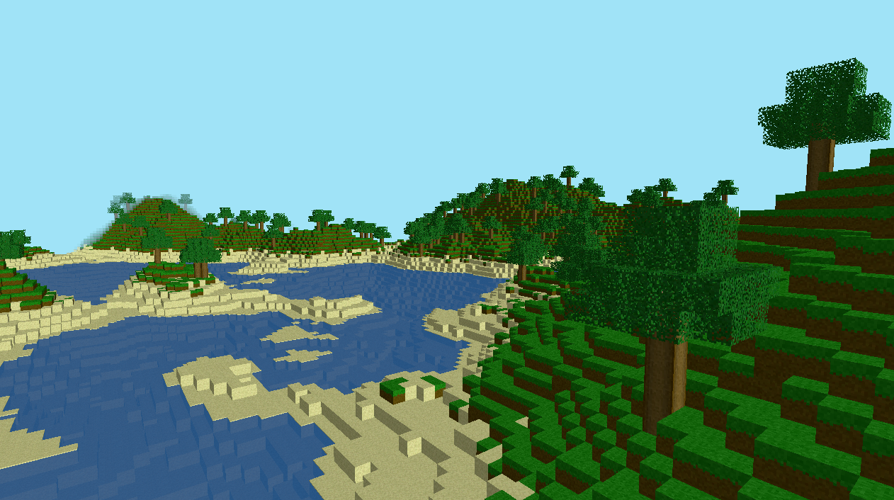

# FreshCraft

A knockoff MineCraft game created using C++ and the Vulkan Graphics and Compute API. 
It features infinite worlds, structures, placing/destroying blocks, and a first person camera.

Blocks:
- Grass
- Dirt
- Water
- Stone
- Sand
- Logs
- Leaves
- Glass
- Gold Ore
- Iron Ore

Compiling:
Either compile using the supplied MSVC project files or do it yourself using g++ or mingw. Just link the VulkanSDK, GLFW3, GLM, STB Image, and TinyOBJ Loader. The Source\ directory also must be provided as an include directory.
